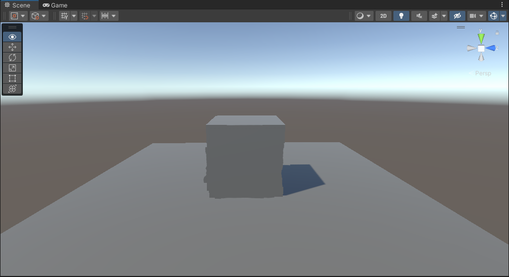
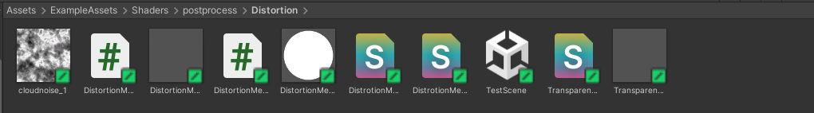
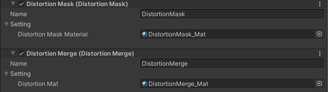
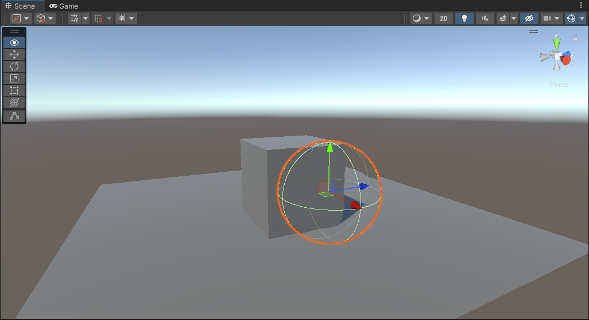

## Distortion

使用urp renderfeature制作局部扭曲效果。

## 项目版本

unity 2021.3.10f1c2

urp 12.1.7(正常unity版本下的对应urp版本)

##  文件结构

该效果使用了两个RenderFeature：DistortionMask.cs和DistortionMerge.cs，前者用于渲染局部Mask并公开，后者用于使用该Mask来实现局部扭曲。其所需的后处理shader以及材质为对应名称的文件。

除此之外，Transparent.shader为普通的透明材质，给场景中的投射器使用的。cloudnoise作为扭曲的噪声，需要赋予DistortionMerge_Mat。

## 使用方法

由于该效果没有设置可调参数，所以没有使用Volume组件，可自行添加。

同理，在Renderer中添加Mask和Merge两个Renderfeature，赋值两个对应的材质：

Mask脚本中已提前设置渲染顺序在Merge之前。

之后在场景中创建一个object作为投射器，这里以Sphere为例，将其Layer层级中添加一个叫做DistortionMask的层级，并选择该Layer，然后将Transparent_Mat赋予这个物体就可以了。

目前只是简单实现了大框架，效果本身有很多问题：例如边缘锯齿化，性能优化等。