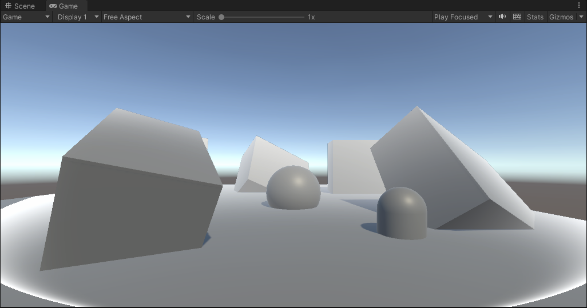
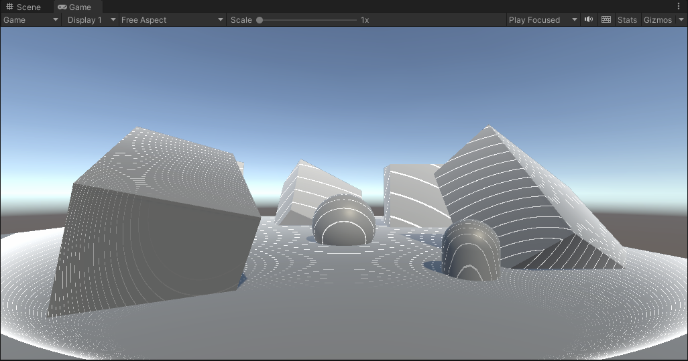
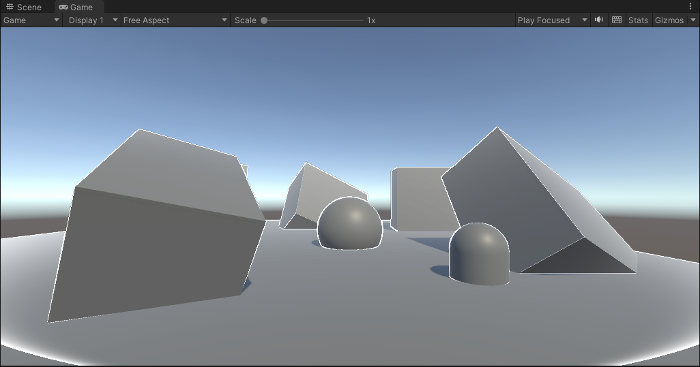
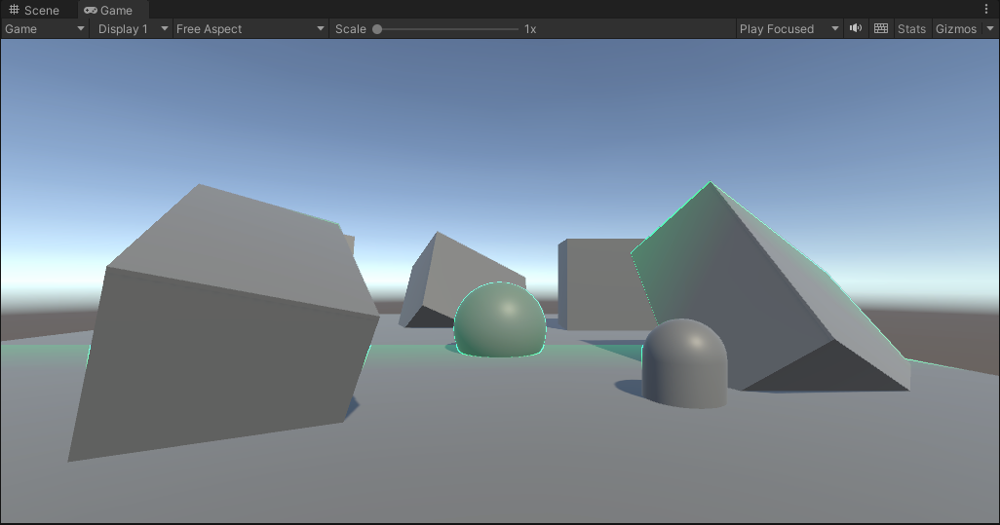
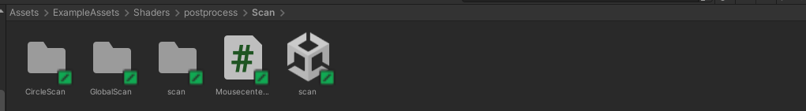
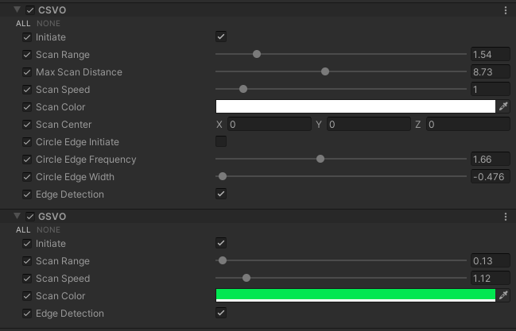

## Distortion

使用urp renderfeature制作扫描效果。

- 圆形扫描

  

  

  

- 全局扫描

  

## 项目版本

unity 2021.3.10f1c2

urp 12.1.7(正常unity版本下的对应urp版本)

##  文件结构

按文件夹名称分类。

## 使用方法

常规的后处理使用流程，需要注意的是如果要使用边缘检测，则要添加一个叫做DepthNormalsFeature.cs的renderfeature，该文件在CircleScan文件夹里面，用于获得一张深度法线图，并暴露为_CameraDepthNormalTexture。这是因为urp不能像buildin里面直接获得，所以需要用rf来获得一下。

Volume设置面板如下，鼠标停留有注释说明。

在具体实现中，由于圆形扩散需要重建世界坐标，处于学习在CircleScan.shader中两种方法都做了尝试(深度图重建以及相机重建)。

